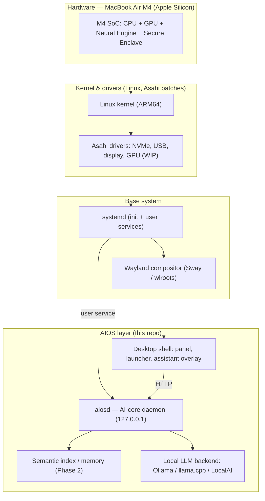

# AIOS Architecture

This document describes the target architecture and the part that exists today.
It corrects several technical points from the original research report.

## Layer overview



Boxes that exist and run today: **aiosd**, **BACKEND** (Ollama), and the CLI (not
shown — it's another HTTP client of `aiosd`, like the shell will be). Everything
below the AIOS layer is provided by Asahi + a standard Linux base; we integrate,
we don't reimplement it.

## The AI core (implemented)

```
aios (CLI) ─┐                                    ┌── context provider (time, host, OS, battery)
            ├── HTTP ──▶ aiosd ──▶ Assistant ────┼── Retriever ──▶ VectorStore  (your indexed files)
shell UI ───┘           (loopback)     │         └── Backend ──▶ local LLM (Ollama / llama.cpp)
                                       │
                        Indexer ──▶ Embedder ──▶ VectorStore   (populated by `aios index`)
```

- **`aiosd`** ([ai-core/aiosd/server.py](../ai-core/aiosd/server.py)) — a
  `ThreadingHTTPServer` bound to `127.0.0.1`. Routes: `GET /health`,
  `POST /v1/chat`. Threaded so a slow inference call can't block health checks.
- **Assistant** ([assistant.py](../ai-core/aiosd/assistant.py)) — the single
  composition seam. Builds `[system persona + context] + history + prompt`. This
  is where retrieval (Phase 2) and tool-calling (Phase 4) plug in.
- **Backends** ([backends.py](../ai-core/aiosd/backends.py)) —
  `OllamaBackend` posts to `/v1/chat/completions` (OpenAI-compatible, so it also
  works against llama.cpp-server and LocalAI unchanged); `MockBackend` is
  deterministic and offline and powers the test suite.
- **Context** ([context.py](../ai-core/aiosd/context.py)) — best-effort, never
  raises. Today: time, user, host, OS, battery. Future: active window, selected
  text, calendar.

### Semantic memory (implemented, Phase 2)

- **Embedder** ([embeddings.py](../ai-core/aiosd/embeddings.py)) — `HashingEmbedder`
  (deterministic feature hashing, no model/network, the default) or `OllamaEmbedder`
  (dense embeddings from a local model). Both return L2-normalized vectors.
- **VectorStore** ([store.py](../ai-core/aiosd/store.py)) — in-memory records keyed
  by id, cosine search (dot product on normalized vectors), atomic JSON persistence.
- **Indexer** ([indexer.py](../ai-core/aiosd/indexer.py)) — walks paths, skips
  hidden/dependency dirs and non-text/large files, chunks with overlap, embeds.
- **Retriever** ([retriever.py](../ai-core/aiosd/retriever.py)) — embeds the query,
  pulls top-k chunks, and the Assistant injects them as cited excerpts before
  answering (RAG). Same retriever backs the `/v1/search` endpoint.

All of this is local: the index lives in a file under `~/.local/share/aios/`,
and nothing is uploaded.

### Sessions & persistence (implemented, Phase 2.5)

- **Storage** ([storage.py](../ai-core/aiosd/storage.py)) — a thread-safe SQLite
  store (`sessions`, `messages`) under `~/.local/share/aios/aios.db`. A chat with a
  `session_id` loads prior turns from the DB, so context survives restarts; the
  daemon persists each user/assistant turn and auto-titles a session from its
  first message. Deleting a session cascades to its messages.

### Tools & the agent loop (implemented, Phase 2.5)

- **Tools** ([tools.py](../ai-core/aiosd/tools.py)) — a registry of typed,
  schema-described capabilities. Built-ins are read-only and filesystem tools are
  sandboxed to the user's home (+ `AIOS_ALLOWED_ROOTS`) with realpath checks.
  Every tool declares `safe`; mutating tools require explicit approval.
- **Agent** ([agent.py](../ai-core/aiosd/agent.py)) — a backend-agnostic loop:
  the model requests tool calls, the registry executes them (respecting the
  approval gate), results are fed back, and the loop continues until the model
  answers. `OllamaBackend.chat_with_tools` wires this to real model tool-calling;
  a scripted backend makes the loop deterministically testable. Rationale and the
  full safety model: [ADR-0002](decisions/0002-tools-safety.md).

### Security & operations (implemented, Phase 2.5)

- **Auth** — optional bearer token (`AIOS_TOKEN`) required on every endpoint
  except `/health`.
- **Limits** — oversized request bodies are rejected (413) before parsing.
- **Observability** — structured request logging (method, path, status, latency)
  and a `/version` endpoint. `AppState` in [server.py](../ai-core/aiosd/server.py)
  wires the subsystems together and is exposed on the server object so resources
  (the DB connection) are closed cleanly on shutdown.

### Data flow & privacy

1. User text enters via the CLI or (later) the desktop overlay.
2. `aiosd` assembles the prompt locally and calls the local model backend.
3. The reply returns over loopback. **No outbound network connection is made**
   unless you explicitly point a backend at a remote endpoint.

No telemetry. No analytics. The daemon binds to loopback only. User data and
prompts stay on the device.

## Security model (target)

- `aiosd` runs as a **non-root user service** under systemd, hardened via the
  unit in [packaging/systemd/aiosd.service](../packaging/systemd/aiosd.service)
  (`NoNewPrivileges`, `ProtectSystem=strict`, `ProtectHome=read-only`,
  restricted address families).
- Desktop apps run sandboxed via **Flatpak**.
- Anything the model *generates and would execute* goes through a
  **preview-before-run** gate (Phase 4). The model never silently runs code.

## Corrections to the original research report

1. **No T2 chip on Apple Silicon.** M1–M4 SoCs integrate the Secure Enclave and
   security functions directly; the T2 was a discrete coprocessor on *Intel*
   Macs. Any driver/firmware strategy referencing a "T2 on M4" is incorrect.
2. **We do not write or fork the kernel.** The report framed a Linux-kernel
   effort with Apple patches "as ours." In practice we consume Asahi's kernel and
   drivers unchanged; our work is the userspace AI + desktop layer.
3. **One OpenAI-compatible backend path**, not a bespoke protocol. Ollama,
   llama.cpp-server, and LocalAI all speak `/v1/chat/completions`, so a single
   `OllamaBackend` covers all three.
4. **GPU acceleration on Asahi is a dependency, not a given.** Expect a window of
   CPU/software rendering on the M4; the roadmap does not block on it.

## Why Python + stdlib for Phase 1

Fastest path to a *running, tested* daemon on the Mac with zero dependency risk
(important on brand-new Python 3.14). The daemon is intentionally small and
protocol-first, so a later rewrite as a single-binary Rust service — the right
production shape for an always-on system daemon — is a contained effort behind
the same HTTP contract. See
[docs/decisions/0001-scope-and-strategy.md](decisions/0001-scope-and-strategy.md).
